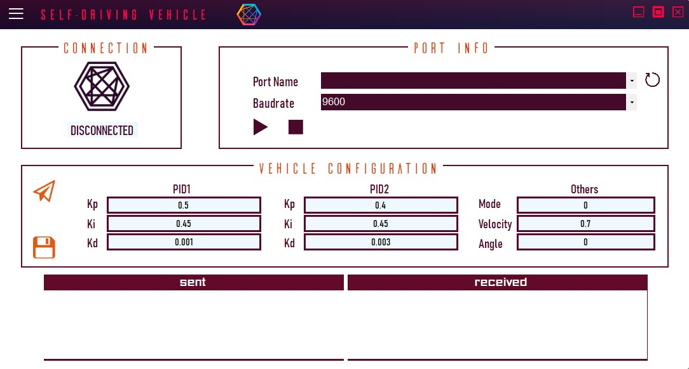
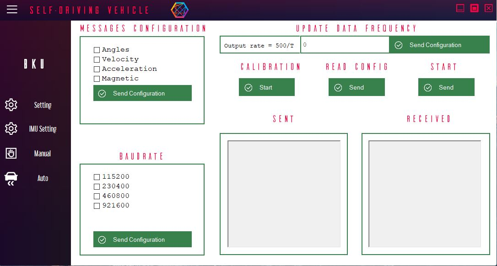
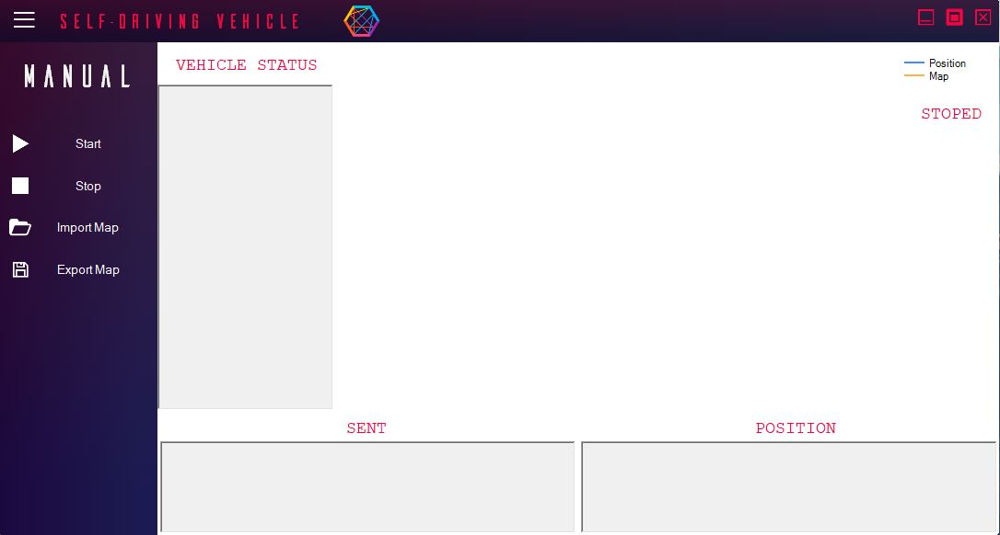
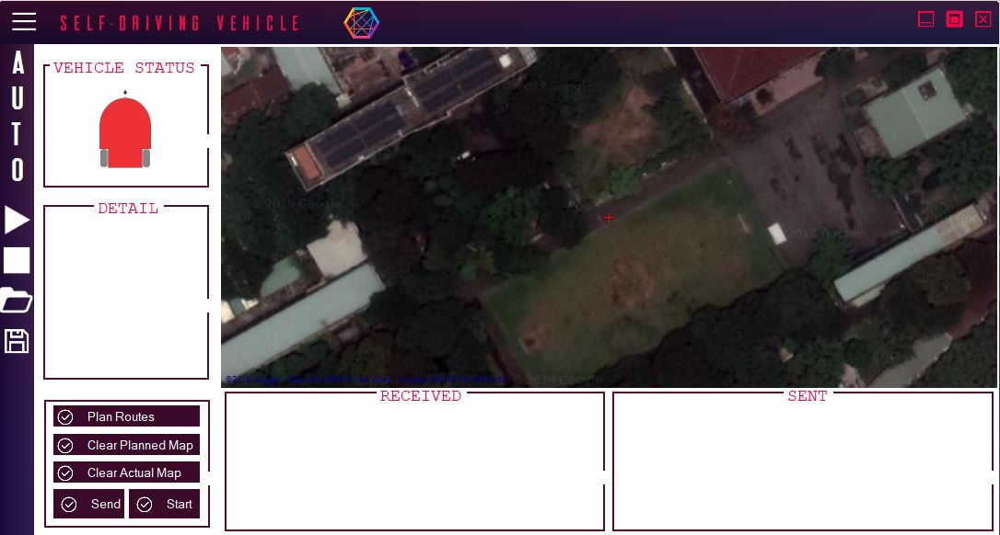

## SVInterface

### Table Of Content

[I. Setting User Control](#SettingUC)
- [1. Port Info](#PortInfo)
- [2. Vehicle Configuration](#VehicleConfiguration)
- [3. Message Boxes](#MessageSettingBoxes)

[II. Setting IMU User Control](#SettingIMUUC)
- [1. Messages Configuration](#MessIMUConfig)
- [2. Message Boxes](#MessageIMUBoxes)

[III. Manual User Control](#ManualUC)
- [1. Vehicle Status](#VehicleStatus)
- [2. Offline Map](#OfflineMap)
- [3. Message Boxes](#MessageManualBoxes)

[IV. Auto User Control](#AutoUC)
- [1. Vehicle Status](#VehicleStatusAuto)
- [2. Detail](#Detail)
- [3. Online Map](#OnlineMap)
- [4. Message Boxes](#MessAutoBoxes)

## I. Setting User Control

  

## II. Setting User Control for IMU

  

## III. Manual User Control

  

## IV. Auto User Control

  

